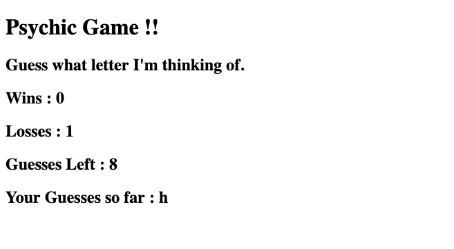

# Psychic-Game

## How the Game works :

### The app randomly picks a letter, and the user has to guess which letter the app chose. If the users guesses the right letter, the score goes up by 1. If the user guesses the wrong letter, the number of guesses left goes down and the guessed letter is displayed. When the user runs out of guesses, the number of losses is displayed and the game restarts.

## Built with :

* [HTML](https://www.w3schools.com/html/html_intro.asp) 

* [JavaScript](https://www.w3schools.com/js/js_intro.asp)

## Authors

* [Raghav Shiv](https://github.com/rshiv7)